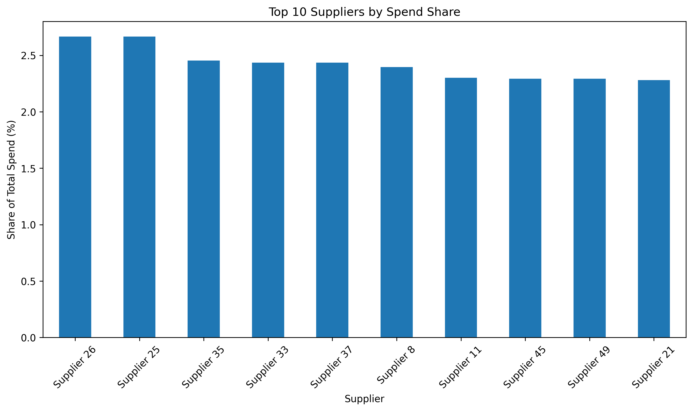
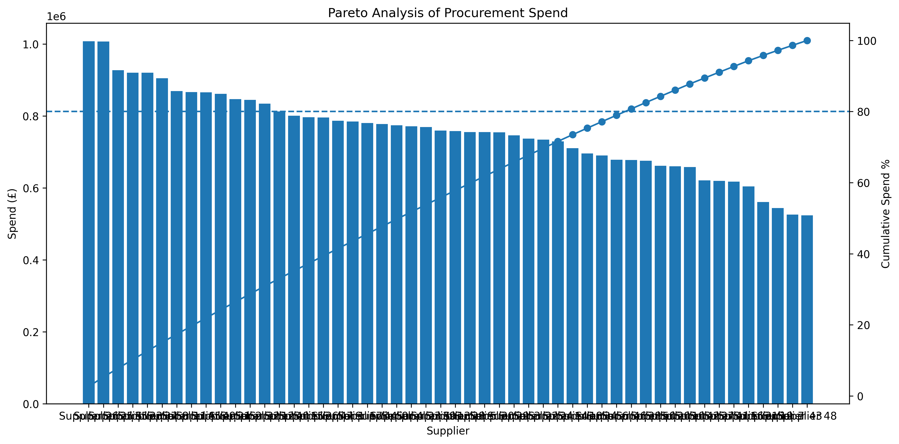

# Procurement Spend Analysis

## Project Overview

This project analyses procurement spending patterns to identify supplier concentration, category expenditure, and procurement risk indicators.

The objective is to support procurement decision-making through data-driven insights and visual analytics.

---

## Business Objectives

The analysis addresses the following procurement questions:

- Which suppliers receive the highest procurement spend?
- How is expenditure distributed across purchasing categories?
- Is procurement spend concentrated among a small number of suppliers?
- What procurement risks can be identified through spend analysis?

---

## Technologies Used

- Python
- Pandas
- NumPy
- Matplotlib
- Google Colab
- GitHub

---

## Dataset Overview

The dataset contains procurement transactions including:

- Purchase Order Number
- Supplier
- Category
- Spend Value
- Order Date

---

## Analysis Conducted

### 1. Procurement KPI Analysis

Key procurement indicators were calculated including:

- Total Procurement Spend
- Number of Suppliers
- Number of Categories
- Average Purchase Order Value

### Key Results

- Total Procurement Spend: £37.78M
- Suppliers Analysed: 50
- Categories Analysed: 6
- Average Purchase Order Value: £12.59K

---

### 2. Supplier Spend Analysis

Supplier expenditure was analysed to identify strategic suppliers and spending concentration.

### Key Insight

The highest-spend supplier accounted for approximately £1.01M in procurement expenditure.

---

### 3. Category Spend Analysis

Procurement expenditure was evaluated across major purchasing categories.

### Key Insight

Raw Materials represented the largest procurement category, accounting for approximately £6.59M of expenditure.

---

### 4. Pareto Analysis

Pareto analysis was used to assess procurement concentration and identify the suppliers responsible for the majority of spend.

### Key Insight

Procurement spend is distributed across a broad supplier base, reducing supplier concentration risk.

---

### 5. Supplier Dependency Analysis

Supplier dependency metrics were developed to assess procurement resilience.

### Key Results

- Top Supplier Spend Share: 2.67%
- Top 5 Suppliers Spend Share: 12.66%
- Top 10 Suppliers Spend Share: 24.22%

These results indicate a diversified supplier portfolio and low dependency on individual suppliers.

---

## Visualisations

### Supplier Dependency Analysis

### Category Spend Analysis

### Pareto Analysis

---

## Business Impact

This project demonstrates how procurement analytics can support:

- Strategic sourcing decisions
- Supplier risk management
- Spend visibility
- Procurement cost optimisation
- Supply chain resilience

---

## Skills Demonstrated

- Procurement Analytics
- Spend Analysis
- Supplier Risk Assessment
- Pareto Analysis
- Data Visualisation
- Python
- Pandas
- Matplotlib
- Business Analytics

---

## Author

Muhammad Ahmed Shoaib

MSc Business Analytics  
Queen's University Belfast

Interested in Procurement Analytics, Supply Chain Analytics, Inventory Optimisation, and Data-Driven Decision Making.
